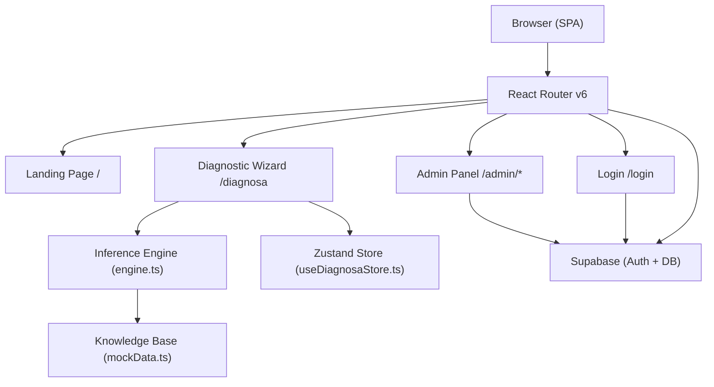
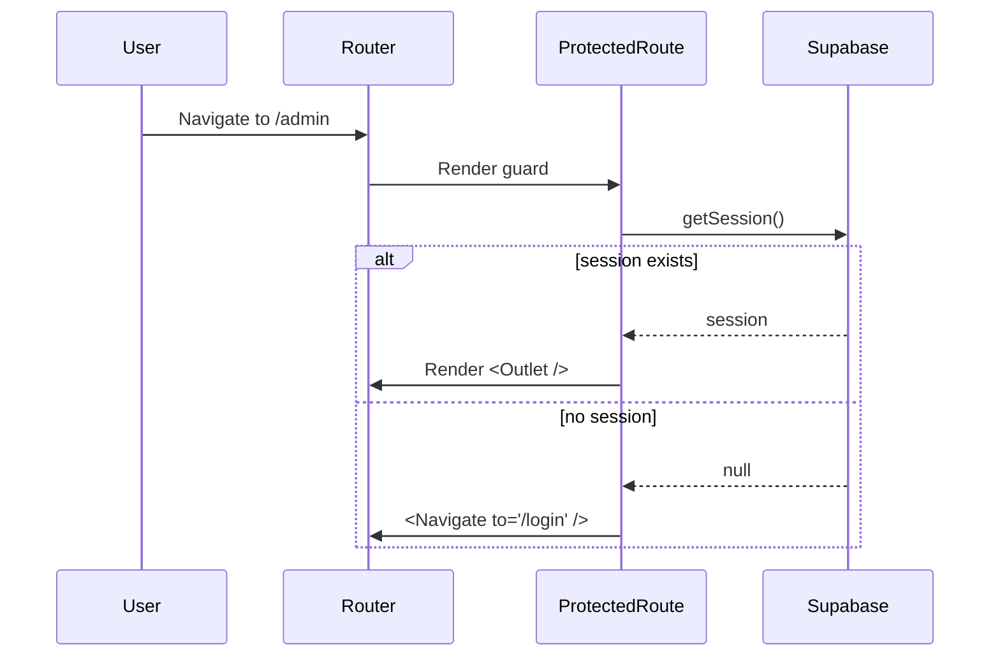

# Design Document — CekHP Diagnostic Tool

## Overview

CekHP is a production-ready React Single Page Application (SPA) built as a final-year thesis project. It implements a **Forward Chaining Expert System** that helps users diagnose common smartphone hardware and software problems through a guided 4-step Diagnostic Wizard. The application demonstrates academic-grade, data-driven inferencing: user-selected symptoms (Facts) are matched against a rule-based Knowledge Base (Rules) to arrive at a diagnosis (Conclusion / Condition).

### Key Objectives

- Implement a textbook Forward Chaining inference engine that is pure, deterministic, and framework-agnostic.
- Provide a polished consumer-facing UX with Playful Claymorphism design language.
- Support offline usage via PWA (service worker + Web App Manifest).
- Provide a protected Admin Panel for Knowledge Base CRUD via Supabase.
- Meet performance benchmarks (Lighthouse ≥ 90) and accessibility standards (WCAG 2.1 AA).

### Technology Stack

| Concern | Choice |
|---|---|
| Framework | React 18 + TypeScript (strict mode) |
| Build tool | Vite 5 |
| Routing | React Router v6 |
| State management | Zustand |
| Backend / Auth | Supabase (PostgreSQL + GoTrue Auth) |
| SEO meta tags | react-helmet-async |
| PWA | vite-plugin-pwa (Workbox) |
| Styling | Tailwind CSS + custom Claymorphism design tokens |
| Code splitting | React.lazy + Suspense (route-level) |
| Testing (unit/property) | Vitest + fast-check |

---

## Architecture

### High-Level Architecture



### Layered Architecture

```
┌─────────────────────────────────────────────────────────┐
│                     Presentation Layer                   │
│   Landing   Wizard Steps 1-4   Login   Admin Panel      │
├─────────────────────────────────────────────────────────┤
│                     Application Layer                    │
│   useDiagnosaStore (Zustand)   ProtectedRoute wrapper   │
├─────────────────────────────────────────────────────────┤
│                     Domain Layer                         │
│   Inference Engine (engine.ts)  Knowledge Base Types    │
├─────────────────────────────────────────────────────────┤
│                  Infrastructure Layer                    │
│   Supabase Client   mockData.ts   Service Worker (SW)   │
└─────────────────────────────────────────────────────────┘
```

### Routing Structure

```
/                   → Landing Page (public, lazy-loaded)
/diagnosa           → Diagnostic Wizard (public, lazy-loaded)
/login              → Login Page (public, redirects to /admin if authenticated)
/admin              → Admin Dashboard (protected)
/admin/symptoms     → Symptoms CRUD (protected)
/admin/conditions   → Conditions CRUD (protected)
/admin/rules        → Rules CRUD (protected)
```

All routes are lazy-loaded with `React.lazy` + `Suspense` to satisfy the 200 KB initial payload budget.

### Route Protection Strategy

A `<ProtectedRoute>` wrapper component subscribes to the Supabase `onAuthStateChange` listener. Unauthenticated requests to `/admin/**` are redirected to `/login`; authenticated requests to `/login` are redirected to `/admin`.



---

## Components and Interfaces

### Component Tree

```
App
├── AppProviders (HelmetProvider, Router)
├── Suspense (global fallback spinner)
└── Routes
    ├── / → <LandingPage />
    │    ├── <Navbar />
    │    ├── <HeroSection />
    │    ├── <FeaturesSection />
    │    ├── <HowItWorksSection />
    │    ├── <TestimonialsSection />
    │    └── <Footer />
    ├── /diagnosa → <DiagnosaPage />
    │    ├── <WizardProgress stepper />
    │    ├── <Step1DeviceCategory />
    │    ├── <Step2SymptomCategory />
    │    ├── <Step3SpecificSymptoms />
    │    └── <Step4Results />
    ├── /login → <LoginPage />
    │    └── <LoginForm />
    └── /admin → <ProtectedRoute>
         └── <AdminLayout>
              ├── <Sidebar />
              └── <Outlet />
                   ├── /admin             → <AdminDashboard />
                   ├── /admin/symptoms    → <SymptomsAdmin />
                   ├── /admin/conditions  → <ConditionsAdmin />
                   └── /admin/rules       → <RulesAdmin />
```

### Key Component Interfaces

```typescript
// Claymorphism Card primitive
interface ClayCardProps {
  children: React.ReactNode;
  className?: string;
  selected?: boolean;    // adds highlighted border + scale transform
  onClick?: () => void;
}

// Wizard step progress indicator
interface WizardProgressProps {
  currentStep: 1 | 2 | 3 | 4;
  totalSteps: 4;
}

// Step 1
interface Step1Props {
  onNext: () => void;
}

// Step 2
interface Step2Props {
  onNext: () => void;
  onBack: () => void;
}

// Step 3
interface Step3Props {
  symptoms: Symptom[];
  onDiagnose: () => void;
  onBack: () => void;
}

// Step 4
interface Step4Props {
  results: DiagnosisResult[];
  conditions: Condition[];
  onReset: () => void;
}

// Admin DataTable
interface DataTableProps<T> {
  data: T[];
  columns: ColumnDef<T>[];
  pageSize?: number;   // default 10
  isLoading?: boolean;
}
```

### Inference Engine Interface

```typescript
// src/lib/engine.ts
export function runInference(
  activeFacts: string[],
  rules: Rule[]
): DiagnosisResult[]
```

The engine is a **pure function** — no side effects, no imports from React or Supabase. It is independently testable.

### Supabase Client

A singleton `supabase` client is exported from `src/lib/supabaseClient.ts`. All Supabase interactions (auth, data) go through this client. The client is not imported by `engine.ts` or the Zustand store.

---

## Data Models

### TypeScript Interfaces

```typescript
// src/types/knowledge-base.ts

export interface Symptom {
  id: string;            // unique slug, e.g. "battery-drain-fast"
  name: string;          // human-readable label
  description: string;   // brief explanation shown to user
  category: string;      // e.g. "Battery" | "Screen" | "Performance" | ...
}

export interface Condition {
  id: string;            // unique slug, e.g. "battery-degradation"
  name: string;          // e.g. "Battery Degradation"
  description: string;   // explanation of the condition
  recommendedAction: string; // e.g. "Replace the battery at an authorized service center."
}

export interface Rule {
  id: string;            // unique identifier, e.g. "rule-battery-01"
  symptomIds: string[];  // non-empty; all must match for full confidence
  conditionId: string;   // references Condition.id
}

export interface DiagnosisResult {
  conditionId: string;
  conditionName: string;
  confidenceScore: number; // [0, 1] inclusive
  inferenceLog: string[];  // step-by-step trace of how the engine matched this rule,
                           // e.g. ["Checked rule-battery-01: matched 2/3 symptoms → score 0.67"]
}
```

### Zustand Store Shape

```typescript
// src/store/useDiagnosaStore.ts

interface DiagnosaState {
  // State
  selectedDeviceCategory: string;   // initial: ""
  selectedSymptomCategory: string;  // initial: ""
  activeFacts: string[];            // initial: []
  diagnosisResults: DiagnosisResult[]; // initial: []

  // Actions
  setDeviceCategory: (category: string) => void;
  setSymptomCategory: (category: string) => void;
  toggleFact: (factId: string) => void;
  setResults: (results: DiagnosisResult[]) => void;
  resetStore: () => void;
}
```

### Supabase Database Schema

```sql
-- symptoms table
CREATE TABLE symptoms (
  id          TEXT PRIMARY KEY,
  name        TEXT NOT NULL,
  description TEXT NOT NULL,
  category    TEXT NOT NULL,
  created_at  TIMESTAMPTZ DEFAULT now()
);

-- conditions table
CREATE TABLE conditions (
  id                TEXT PRIMARY KEY,
  name              TEXT NOT NULL,
  description       TEXT NOT NULL,
  recommended_action TEXT NOT NULL,
  created_at        TIMESTAMPTZ DEFAULT now()
);

-- rules table
CREATE TABLE rules (
  id           TEXT PRIMARY KEY,
  condition_id TEXT NOT NULL REFERENCES conditions(id),
  symptom_ids  TEXT[] NOT NULL,   -- array of symptom.id values
  created_at   TIMESTAMPTZ DEFAULT now()
);
```

Row-Level Security (RLS) is enabled on all tables. Anonymous (public) users have SELECT access; authenticated (admin) users have full INSERT, UPDATE, DELETE access.

### Mock Knowledge Base (mockData.ts)

The mock data ships with the app and is cached by the service worker at install time. Minimum required:

- **5 Conditions**: Battery Degradation, GPU Failure, RAM Overflow, Camera Module Failure, Charging Port Damage
- **20 Symptoms** spanning Battery (≥2), Screen (≥2), Performance (≥2), Camera, Connectivity, Audio categories
- **10 Rules** (≥2 per Battery, Screen, Performance categories)

Sample structure:

```typescript
export const mockConditions: Condition[] = [
  {
    id: "battery-degradation",
    name: "Battery Degradation",
    description: "The battery has lost significant capacity due to chemical aging.",
    recommendedAction: "Replace the battery at an authorized service center."
  },
  // ... 4 more
];

export const mockSymptoms: Symptom[] = [
  { id: "battery-drain-fast", name: "Battery drains fast", description: "...", category: "Battery" },
  { id: "battery-overheating", name: "Device overheats while charging", description: "...", category: "Battery" },
  // ... 18 more
];

export const mockRules: Rule[] = [
  { id: "rule-battery-01", conditionId: "battery-degradation", symptomIds: ["battery-drain-fast", "battery-overheating"] },
  // ... 9 more
];
```

### Inference Engine Algorithm

The Forward Chaining algorithm (CF = Certainty Factor approach using ratio-based confidence):

```
function runInference(activeFacts, rules):
  if activeFacts is empty OR rules is empty:
    return []

  deduplicatedFacts = unique values of activeFacts

  results = []
  for each rule in rules:
    if rule.symptomIds is empty: skip (avoid division by zero)

    matchedSymptoms = rule.symptomIds that are present in deduplicatedFacts
    matched = matchedSymptoms.length
    total   = rule.symptomIds.length
    score   = matched / total

    // Build the step-by-step inference log entry for this rule
    logEntry = "Checked " + rule.id + ": matched " + matched + "/" + total
               + " symptoms → score " + format(score, 2dp)
    // List each symptom and whether it was matched
    for each symptomId in rule.symptomIds:
      status = (symptomId in deduplicatedFacts) ? "✓ matched" : "✗ missing"
      logEntry += "\n  " + symptomId + " — " + status

    if score > 0:
      results.push({
        conditionId,
        conditionName,
        confidenceScore: score,
        inferenceLog: [logEntry]   // one entry per rule evaluation
      })

  sort results by confidenceScore DESC, then by rule.id ASC
  return results
```

If no rule has score > 0, return [].

Each `DiagnosisResult.inferenceLog` array contains one string per rule evaluation, formatted for display inside the "Detail Teknis & Log Inferensi" accordion in Step 4.

---

## Correctness Properties

*A property is a characteristic or behavior that should hold true across all valid executions of a system — essentially, a formal statement about what the system should do. Properties serve as the bridge between human-readable specifications and machine-verifiable correctness guarantees.*


### Property 1: Zustand Store Setter Round-Trip

*For any* valid non-empty string `categoryId`, calling `setDeviceCategory(categoryId)` on the Zustand store should result in `selectedDeviceCategory` equaling `categoryId`; and calling `setSymptomCategory(categoryId)` should result in `selectedSymptomCategory` equaling `categoryId`. Each setter stores exactly the value it was given.

**Validates: Requirements 2.4, 3.2**

---

### Property 2: Navigation Button Disabled When Required Field Is Empty

*For any* Zustand store state where `selectedDeviceCategory` is an empty string, the "Next" button on Step 1 must be in a disabled state. Equivalently, *for any* state where `selectedSymptomCategory` is an empty string, the "Next" button on Step 2 must be in a disabled state. *For any* state where `activeFacts` is an empty array, the "Diagnose" button on Step 3 must be in a disabled state.

**Validates: Requirements 2.6, 3.4, 4.5**

---

### Property 3: Symptom List Filtered by Selected Category

*For any* `selectedSymptomCategory` value and *any* list of `Symptom` objects with varying categories, the symptoms rendered in Step 3 should contain only symptoms whose `category` field equals `selectedSymptomCategory`. No symptom from a different category should be displayed.

**Validates: Requirements 4.1**

---

### Property 4: toggleFact Add/Remove Round-Trip

*For any* fact ID string (non-empty), calling `toggleFact(factId)` when `factId` is not in `activeFacts` should add it; calling `toggleFact(factId)` when it is already in `activeFacts` should remove it. Consequently, *for any* fact ID and *any* initial `activeFacts`, calling `toggleFact(factId)` twice in succession should return `activeFacts` to its exact original state.

*For any* non-empty set of distinct fact IDs, toggling each one exactly once should result in all of them being present in `activeFacts` simultaneously (multi-selection invariant).

**Validates: Requirements 4.2, 4.3, 8.3, 8.4**

---

### Property 5: toggleFact Empty String No-Op

*For any* `activeFacts` state, calling `toggleFact("")` should leave `activeFacts` completely unchanged — no elements added, removed, or reordered.

**Validates: Requirements 8.6**

---

### Property 6: resetStore Restores Initial State

*For any* arbitrary combination of `selectedDeviceCategory`, `selectedSymptomCategory`, `activeFacts`, and `diagnosisResults` values in the Zustand store, calling `resetStore()` should set all four fields back to their specified initial values: `""`, `""`, `[]`, `[]`.

**Validates: Requirements 8.5**

---

### Property 7: Inference Engine Confidence Score Formula

*For any* `Rule` with `N` symptom IDs and *for any* `activeFacts` array containing exactly `M` of those symptom IDs (where `0 ≤ M ≤ N`), the `confidenceScore` returned by `runInference` for that rule should equal `M / N`. When `M = N` (all symptoms present), the score must equal `1.0`. When `M = 0` (no symptoms present), the score must equal `0.0`.

**Validates: Requirements 6.3, 6.4**

---

### Property 8: Inference Engine Empty Input Returns Empty Array

*For any* non-empty `rules` array, calling `runInference([], rules)` must return an empty array. *For any* non-empty `activeFacts` array, calling `runInference(activeFacts, [])` must return an empty array. In both cases, no evaluation is performed.

**Validates: Requirements 6.7**

---

### Property 9: Inference Engine Output Sorting

*For any* `activeFacts` and `rules` inputs that produce a non-empty result, the returned `DiagnosisResult` array from `runInference` must be sorted in descending order by `confidenceScore`. When two results share the same `confidenceScore`, they must appear in ascending lexicographic order of their `Rule.id`.

Formally: for all adjacent pairs `(results[i], results[i+1])` in the output:
- `results[i].confidenceScore >= results[i+1].confidenceScore`
- If `results[i].confidenceScore === results[i+1].confidenceScore` then `results[i].ruleId <= results[i+1].ruleId`

**Validates: Requirements 5.3, 6.5**

---

### Property 10: Inference Engine Determinism

*For any* non-empty `activeFacts` array of valid symptom IDs and *any* `rules` array, calling `runInference(activeFacts, rules)` multiple times must return structurally identical arrays on every invocation — same length, same `conditionId`, same `confidenceScore`, in the same order. The engine must produce no observable side effects between calls.

**Validates: Requirements 6.1, 7.5**

---

### Property 11: Results View Contains All Required Condition Fields

*For any* non-empty `DiagnosisResult` array and corresponding `Condition` lookup data, each result card rendered in Step 4 must display all four of: the condition's `name`, `description`, `confidenceScore` formatted as a percentage, and `recommendedAction`. No field may be omitted from the rendered output.

Additionally, each result card must render a "Detail Teknis & Log Inferensi" accordion section. When expanded, the accordion must display every entry in `DiagnosisResult.inferenceLog` as a readable line — no `inferenceLog` entry may be silently dropped.

**Validates: Requirements 5.4**

---

### Property 12: Results Page Title Includes Top Condition Name

*For any* non-empty, sorted `DiagnosisResult` array (sorted descending by `confidenceScore`), when the Step 4 Results view is rendered, the HTML `<title>` set via `react-helmet-async` must be a non-empty string that contains the `conditionName` of the first element in the array (i.e., the highest-confidence diagnosis).

**Validates: Requirements 5.7**

---

### Property 13: Admin Form Validation Blocks Submission on Invalid Input

*For any* Create or Edit form submission in the Admin Panel where at least one required field is either an empty string or a string exceeding 255 characters, the form handler must: (a) display an inline validation error on each offending field, and (b) not invoke any Supabase write operation. No network call should be made when the form is in an invalid state.

**Validates: Requirements 9.6, 10.7**

---

## Error Handling

### Inference Engine Errors

The engine is a pure function and cannot throw under normal operation. However, defensive checks are applied:

- If `rules` contains a rule with an empty `symptomIds` array: skip that rule (do not divide by zero).
- If `activeFacts` contains duplicate strings: de-duplicate before matching to avoid inflated scores.

### Wizard Navigation Errors

- Back button guards: if required previous-step state is missing, stay on current step (see Requirements 3.5, 4.7).
- If `resetStore` throws unexpectedly: catch the error, display an error toast, and do not navigate (Requirement 5.6).

### Supabase Error Handling

All Supabase calls are wrapped in try/catch. Errors are surfaced via a toast notification system that displays:
- The operation that failed (create / update / delete / fetch)
- A user-friendly message (not a raw Supabase error code)
- The DataTable state is not mutated on failure (optimistic update is rolled back)

### Authentication Errors

- Empty form fields: client-side validation before Supabase call (inline field errors).
- Invalid credentials / network failure: toast notification; user stays on `/login`.
- Session expiry: `onAuthStateChange` listener detects `SIGNED_OUT` event and redirects to `/login`.

### PWA / Offline Errors

- Mock KB not in cache: display a visible offline-unavailable message inside the Wizard container (not a browser alert).
- Failed service worker registration: app degrades gracefully — continues functioning as a standard web app without offline support; no error is surfaced to the user.

### React Error Boundaries

Each major route (Landing, Wizard, Admin) is wrapped in an `<ErrorBoundary>` component. If a runtime render error occurs, the fallback renders a generic "Something went wrong" notification with a "Reload" button (Requirement 5.5 secondary fallback).

---

## Testing Strategy

### Overview

Testing follows a **dual approach**: property-based tests for universal invariants (using Vitest + fast-check) and example-based unit tests for specific behaviors, edge cases, and integration points.

### Property-Based Testing

PBT applies to this feature because the Inference Engine is a **pure function** with a large input space (any combination of fact IDs and rules), the Zustand store has clear input/output behavior, and there are meaningful universal invariants (sorting, toggle round-trips, formula correctness).

**Library:** [fast-check](https://github.com/dubzzz/fast-check) (TypeScript-native, Vitest-compatible)

**Configuration:** Each property test runs a **minimum of 100 iterations** (`numRuns: 100`).

**Tag format for each test:**
```typescript
// Feature: cekhp-diagnostic-tool, Property N: <property_text>
```

**Properties to implement as PBT tests:**

| Property | Test File | fast-check Arbitraries |
|---|---|---|
| P1: Store setter round-trip | `store.property.test.ts` | `fc.string()` |
| P2: Button disabled when empty | `wizard.property.test.ts` | `fc.constant("")` |
| P3: Symptom filtering | `step3.property.test.ts` | `fc.array(fc.record({...}))` |
| P4: toggleFact round-trip | `store.property.test.ts` | `fc.string()`, `fc.array(fc.string())` |
| P5: toggleFact empty string no-op | `store.property.test.ts` | `fc.array(fc.string())` |
| P6: resetStore restores initial | `store.property.test.ts` | `fc.record({...})` |
| P7: Confidence score formula | `engine.property.test.ts` | `fc.array(fc.string())` |
| P8: Empty input → empty output | `engine.property.test.ts` | `fc.array(fc.record({...}))` |
| P9: Output sorting | `engine.property.test.ts` | `fc.array(fc.record({...}))` |
| P10: Determinism | `engine.property.test.ts` | `fc.array(fc.string())` |
| P11: Results card fields | `step4.property.test.ts` | `fc.array(fc.record({...}))` |
| P12: Results page title | `step4.property.test.ts` | `fc.array(fc.record({...}))` |
| P13: Admin form validation | `adminForm.property.test.ts` | `fc.string()`, `fc.constant("")` |

### Unit / Example-Based Tests

Focus areas:
- **Wizard navigation** (back/next guards with both present and absent state)
- **Step 1** initial state (5 device options, step counter, disabled Next)
- **Step 4** fallback message (empty results array)
- **Step 4** "Diagnose Again" button invokes resetStore
- **Mock KB** minimum counts and category coverage
- **Admin Panel** sidebar navigation, DataTable pagination
- **Login form** empty field inline errors, successful redirect

These live in `*.test.ts` / `*.test.tsx` files alongside the property tests.

### Integration Tests

Run against Supabase or a local emulator (optional in CI):
- Auth flow: login → redirect → logout → redirect
- CRUD operations: create/update/delete each entity type
- Session expiry detection
- DataTable pagination with real data
- PWA offline behavior (Playwright + network throttle)

### Smoke Tests

- TypeScript strict mode compilation passes: `tsc --noEmit`
- Production build completes: `vite build`
- Web App Manifest fields present: parse `dist/manifest.webmanifest`
- Lighthouse Performance ≥ 90 and Accessibility ≥ 90 (Landing, Diagnostic, Results pages)

### Test File Structure

```
src/
├── lib/
│   ├── engine.ts
│   └── __tests__/
│       ├── engine.unit.test.ts
│       └── engine.property.test.ts   ← PBT: Properties 7, 8, 9, 10
├── store/
│   ├── useDiagnosaStore.ts
│   └── __tests__/
│       ├── store.unit.test.ts
│       └── store.property.test.ts    ← PBT: Properties 1, 2, 4, 5, 6
├── pages/diagnosa/
│   └── __tests__/
│       ├── step3.property.test.ts    ← PBT: Property 3
│       └── step4.property.test.ts   ← PBT: Properties 11, 12
└── pages/admin/
    └── __tests__/
        └── adminForm.property.test.ts ← PBT: Property 13
```

### Example Property Test Skeleton

```typescript
// Feature: cekhp-diagnostic-tool, Property 7: Inference engine confidence score formula
import { describe, it } from 'vitest';
import * as fc from 'fast-check';
import { runInference } from '../engine';

describe('Property 7: Confidence score formula', () => {
  it('score = matched / total for any subset of rule symptoms in activeFacts', () => {
    fc.assert(
      fc.property(
        fc.array(fc.string({ minLength: 1 }), { minLength: 1, maxLength: 10 }),
        fc.integer({ min: 0 }).chain(missingCount =>
          fc.tuple(fc.constant(missingCount), fc.array(fc.string({ minLength: 1 }), { minLength: missingCount }))
        ),
        (symptomIds, [missingCount, extraFacts]) => {
          const matched = symptomIds.slice(0, symptomIds.length - missingCount);
          const activeFacts = [...matched, ...extraFacts];
          const rule = { id: 'rule-test', conditionId: 'cond-test', symptomIds };
          const results = runInference(activeFacts, [rule]);

          if (matched.length === 0) {
            return results.length === 0;
          }
          const expectedScore = matched.length / symptomIds.length;
          return Math.abs(results[0].confidenceScore - expectedScore) < 1e-10;
        }
      ),
      { numRuns: 100 }
    );
  });
});
```
